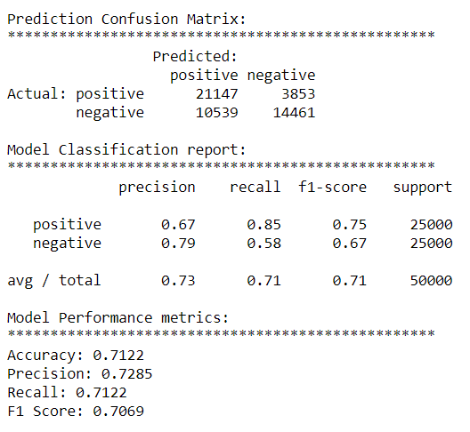
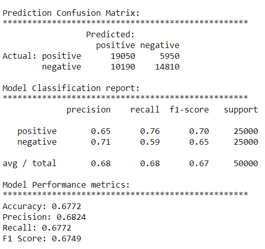

# Movie-Review-Sentiment-Analysis

## Business Value

Sentiment analysis or opinion mining, is to analyze some textual documents and predict their sentiment or opinion based on the content of the document. Sentiment analysis is perhaps one of the most popular applications of natural language processing and text analytics with a vast number of websites, books and tutorials on this subject. Typically sentiment analysis seems to work best on subjective text, where people express opinions, feelings, and their mood. From a real-world industry standpoint, sentiment analysis is widely used to analyze corporate surveys, feedback surveys, social media data, and reviews for movies, places, commodities, and many more. The idea is to analyze and understand the reactions of people toward a specific entity and take insightful actions based on their sentiment. 

## Problem Statement

To build a model to analyze the sentiment of the unstructered moview reviews data and seggregate the textual data based on the sentiment of the movie reviews

## Data

Each row of data represents a review for a movie and the other column contains the predefinedsentiment of the review.

__review__ : Moview reviews, textual unstructured data,  

__sentiment__ : predefined sentiment

## Approach

+ Importing Necessary Libraries

+ Loading Data

+ Cleaning Textual data
Removing HTML Tag
Removing Accented Characters
Expanding Contractions
Removing special characters
Lemmatizing Text
Removing Stopwords

+ Sentiment Analysis
Analysis with AFINN
Analysis with SentiWordNet

In order to measure the performance of the model, we will be using the classification report which includes the accuracy, precision, recall, and F1 score for the model.

## Cleaning Text

__Removing HTML Tag__

Sample Text: 
Hi can you hear me! I just heard about <b>Python</b>! \r\n \n

Cleaned Text:  Hi can you hear me! I just heard about Python

__Removing Accented Charcaters__

Sample Text: Héllo! How are you

Cleaned Text: Hello! How are you

__Expanding Constractions__

Sample Text: It's an amazing language, He's learning

Cleaned Text: It is an amazing language, He is learning

__Removing Special Characters__

Sample Text: Special $#! characters   spaces 888323

Cleaned Text: Special characters spaces 888323

__Lemmatizing Text__

Lemmatization, reduces the inflected words properly ensuring that the root word belongs to the language. In Lemmatization root word is called Lemma. A lemma (plural lemmas or lemmata) is the canonical form, dictionary form, or citation form of a set of words.

Sample Text: The striped bats are hanging on their feet for best

Lemmatized Text:  The strip bat be hang on their foot for best

__Removing Stopwords__

Stopwords are commonly used words in english which do not add much meaning to a sentence and hence they can be safely ignored without altering the meaning of the statrement

Sample Text:  This is a sample sentence, showing off the stop words filtration.

Cleaned Text: This sample sentence, showing stop words filtration.

## Sample Data

__Review__: 'What the (beep) is going wrong with Disney the last years? Are there totally run out of good ideas? Where is the magic? Where are the good animators, the good songwriters, the good directors, the good... Okay, i know, Walt himself and the famous "nine old man" can\'t come back. But is this a reason to crank out countless of those cheap sequels and slowly but surely destroying the ideals of Walt Disney? I never rent or bought a Disney-sequel of what movie however. Because i had read much enough about its (absence of) quality. But "Atlantis: Milo\'s Return" was aired today on TV in Germany and so i watch it. It confirmed my doubts about sequels. It was absolutely boring. Flaw animation, primitive color-rotation, simple characters, some unsuccessful tries to simulate the famous Multiplane-Camera with CGI, mediocre music and a patchwork of different, simple stories. It looks absolutely not like Disney! Not like Disney i know! It looks like one of the countless, cheap and simple animation-series like "DragonballZ", "Beyblade" etc. that aired every day on TV for children.  My first reaction after showing this crap, was to load "Bambi" in my DVD-Player, to see Disney\'s immortal magic, depth, spirit and charm again, to see Disney on its climax again, to see the awesome art of handmade animation again. "Bambi" was the first (and until today the only) movie that i give 10 out of 10 stars. But "Atlantis: Milo\'s Return"? No magic, no depth, no charm, no spirit... It deserved only 3 out of 10!'

__Cleaned Text__ : 'beep going wrong disney last year totally run good idea magic good animator good songwriter good director good okay know walt famous `` nine old man not come back reason crank countless cheap sequel slowly surely destroying ideal walt disney never rent bought disneysequel movie however read much enough absence quality `` atlantis milo return wa aired today tv germany watch confirmed doubt sequel wa absolutely boring flaw animation primitive colorrotation simple character unsuccessful try simulate famous multiplanecamera cgi mediocre music patchwork different simple story look absolutely not like disney not like disney know look like one countless cheap simple animationseries like `` dragonballz `` beyblade etc aired every day tv child first reaction showing crap wa load `` bambi dvdplayer see disney immortal magic depth spirit charm see disney climax see awesome art handmade animation `` bambi wa first today movie give 10 10 star `` atlantis milo return no magic no depth no charm no spirit deserved 3 10'

## Sentiment Analysis

1. ### __AFINN__

	__Review__ : Utter dreck. I got to the 16 minute/27 second point, and gave up. I'd have given it a negative number review if that were possible (although 'pissible' is a more fitting word...). Unlike the sizzle you could see and practically feel between MacMurray and Stanwyck in the original, the chemistry between dumb ol' Dicky Crenna and whats-her-face here is just non-existent. The anklet becomes an unattractive chunky bracelet? There's no ciggy-lighting-by-fingertip? And I thought I'd be SICK when they have a mortified-looking (and rightly so, believe you me) Lee J. Cobb as Keyes practically burping/upchucking his way through the explanation of his "Little Man" to Mr. Garloupis. No offence to the non-sighted, but it looks as though a posse of blind men ran amuck with the set design of both the Dietrichson and Neff houses. The same goes for those horrid plaid pants that Phyllis wears. And crikey, how much $$ does Neff make, that he lives overlooking a huge marina? This, folks, again, all takes place in the first 16 and a half minutes. If you can get through more of it, you have a much stronger constitution than me, or you are a masochist. But please, take some Alka-Seltzer first, or you WILL develop a "little man" of your own that may never go away. Proceed with caution, obviously.

__Actual Sentiment__: negative

__Predicted Sentiment polarity__: -13.0

__Model Evaluation__

2. ### __SentiWordNet__

	__Review__ : Utter dreck. I got to the 16 minute/27 second point, and gave up. I'd have given it a negative number review if that were possible (although 'pissible' is a more fitting word...). Unlike the sizzle you could see and practically feel between MacMurray and Stanwyck in the original, the chemistry between dumb ol' Dicky Crenna and whats-her-face here is just non-existent. The anklet becomes an unattractive chunky bracelet? There's no ciggy-lighting-by-fingertip? And I thought I'd be SICK when they have a mortified-looking (and rightly so, believe you me) Lee J. Cobb as Keyes practically burping/upchucking his way through the explanation of his "Little Man" to Mr. Garloupis. No offence to the non-sighted, but it looks as though a posse of blind men ran amuck with the set design of both the Dietrichson and Neff houses. The same goes for those horrid plaid pants that Phyllis wears. And crikey, how much $$ does Neff make, that he lives overlooking a huge marina? This, folks, again, all takes place in the first 16 and a half minutes. If you can get through more of it, you have a much stronger constitution than me, or you are a masochist. But please, take some Alka-Seltzer first, or you WILL develop a "little man" of your own that may never go away. Proceed with caution, obviously.

__Actual Sentiment__: negative
     
__SENTIMENT STATS__:                                      
  Predicted Sentiment Objectivity Positive Negative Overall
0            negative        0.86     0.06     0.07   -0.01

__Model Evaluation__

## __Conclusion__
On Comparing both the models we see that the AFINN model has higher accuracy asagainst SentiWordNet Model but the SentiWordNet model has gives a detailed overview of the objectivity score of the review along with the polarity score. In SentiWordNet model we get an overall F1-Score of 68%, which is definitely a step down from our AFINN based model which is 71%. While we have lesser number of negative sentiment based reviews being misclassified as positive, in the latter model the other aspects of the model performance have been affected.
